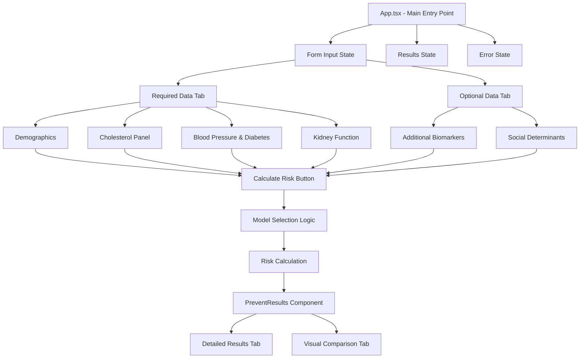
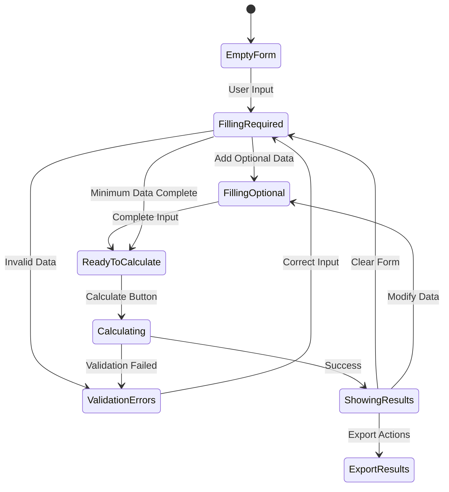
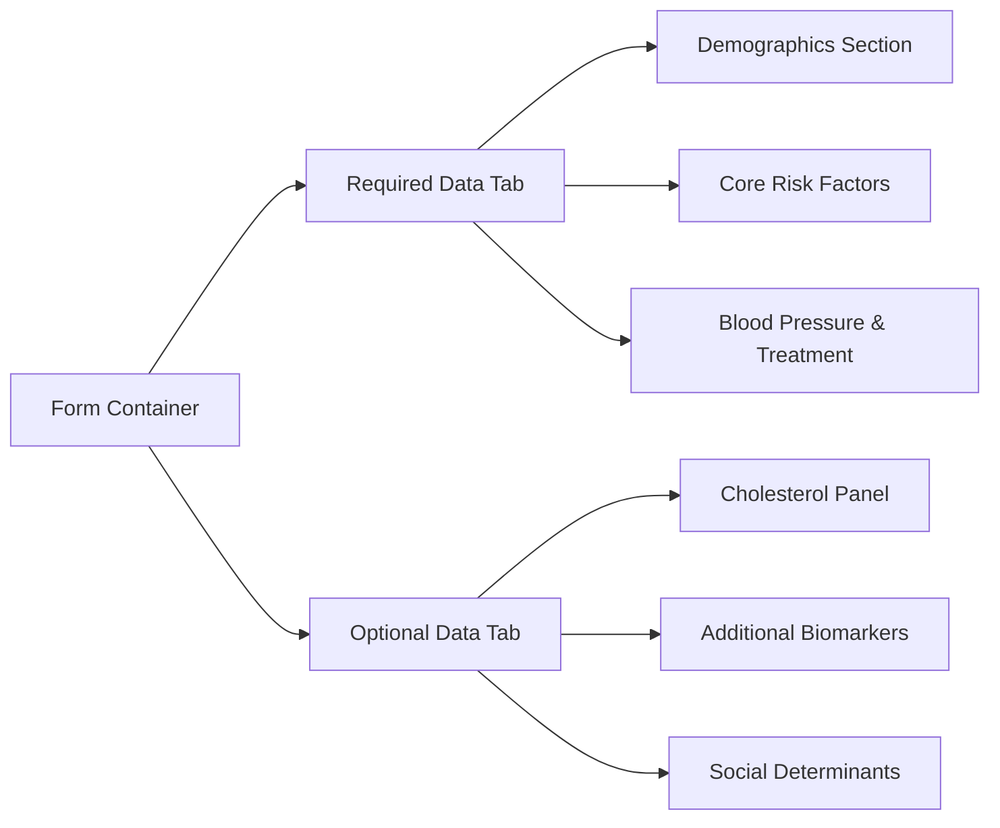
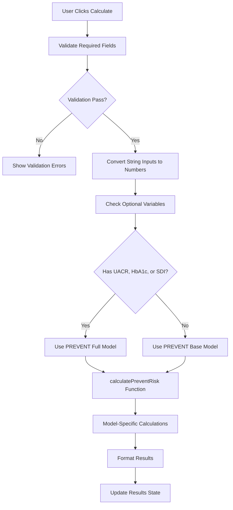
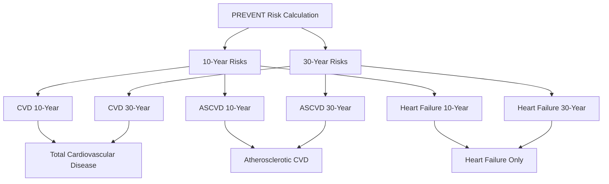
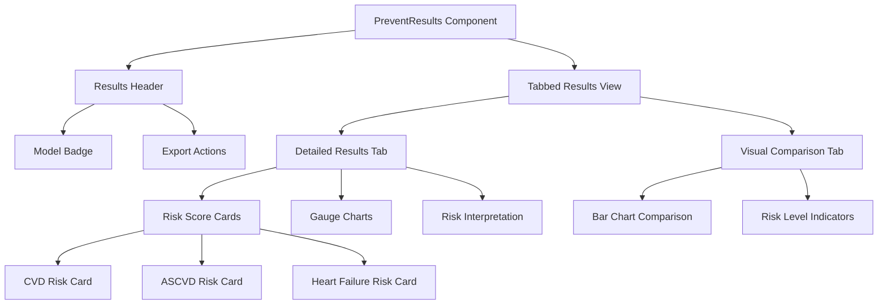
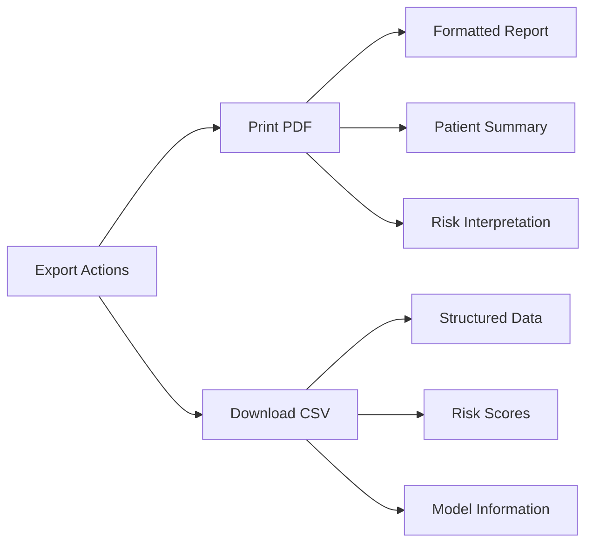
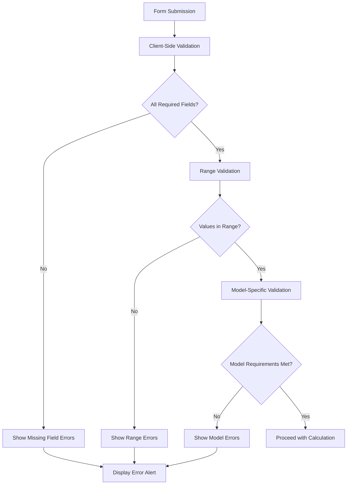

# Calculator Routing Implementation Design

## Overview

This document describes the routing implementation and score calculation architecture of the PREVENT Calculator, a web-based cardiovascular risk assessment tool based on the official American Heart Association (AHA) PREVENT equations. The application uses a single-page architecture without traditional URL routing, focusing on state-based navigation and modular scoring implementations.

## Technology Stack & Architecture

- **Framework**: React 19 + TypeScript
- **Build Tool**: Vite 6.3.5  
- **Styling**: Tailwind CSS 4.1.7 with ShadCN UI components
- **State Management**: Local React state with hooks
- **Form Handling**: React Hook Form + Zod validation
- **Charts**: Recharts for data visualization

## Application Flow Architecture

### Single Page Application Structure

The application implements a state-driven flow rather than traditional routing:



### State Management Flow



## Input Data Architecture

### Interface Definitions

```typescript
interface PreventInputs {
  // Required Demographics
  sex: string;          // '0' = male, '1' = female
  age: string;          // 30-79 years
  
  // Cardiovascular Risk Factors
  sbp: string;          // Systolic BP 90-200 mmHg
  dm: string;           // Diabetes '0' or '1'
  smoking: string;      // Smoking status '0' or '1'
  egfr: string;         // eGFR >0 mL/min/1.73m²
  bptreat: string;      // BP treatment '0' or '1'
  
  // Optional Cholesterol Panel
  tc: string;           // Total cholesterol 130-320 mg/dL
  hdl: string;          // HDL cholesterol 20-100 mg/dL
  statin: string;       // Statin use '0' or '1'
  
  // Optional Additional Variables
  bmi: string;          // BMI 18.5-39.9 kg/m²
  uacr: string;         // UACR ≥0 mg/g
  hba1c: string;        // HbA1c >0 %
  sdi: string;          // SDI decile 1-10
}
```

### Form Validation Architecture

| Field Category | Validation Rules | Error Handling |
|---------------|------------------|----------------|
| Demographics | Age: 30-79, Sex: Required | Immediate feedback |
| Cholesterol | TC: 130-320, HDL: 20-100 | Optional validation |
| Blood Pressure | SBP: 90-200 mmHg | Required validation |
| Kidney Function | eGFR: >0 | Required validation |
| Optional Biomarkers | UACR: ≥0, HbA1c: >0 | Optional validation |
| Social Determinants | SDI: 1-10 deciles | Optional validation |

### Tabbed Input Organization



## Score Calculation Implementation

### Model Selection Logic

The application automatically selects the appropriate PREVENT model based on available data:



### Calculation Models Overview

| Model Type | Required Variables | Optional Variables | Scoring Categories |
|------------|-------------------|-------------------|-------------------|
| **Base Model** | Sex, Age, SBP, DM, Smoking, eGFR, BP Treatment | TC, HDL, Statin, BMI | CVD, ASCVD, HF |
| **Full Model** | Base + Any Optional | UACR, HbA1c, SDI | CVD, ASCVD, HF |

### Risk Score Categories

The calculator produces six primary risk scores:



### Mathematical Implementation

#### Risk Score Conversion Process

1. **Input Preprocessing**:
   - Convert string inputs to numeric values
   - Handle missing optional variables
   - Apply unit conversions (cholesterol mg/dL to mmol/L)

2. **Logistic Regression Calculation**:
   ```
   log_odds = β₀ + β₁×age_term + β₂×chol_term + ... + βₙ×interaction_terms
   ```

3. **Probability Conversion**:
   ```
   risk_percentage = 100 × exp(log_odds) / (1 + exp(log_odds))
   ```

4. **Age-Specific Rules**:
   - 30-year risks only calculated for ages ≤59
   - Specific validation ranges for each variable

#### Helper Functions

| Function | Purpose | Implementation |
|----------|---------|----------------|
| `sdicat(sdi)` | Convert SDI decile to tertile | 1-3→0, 4-6→1, 7-10→2 |
| `mmol_conversion(chol)` | Convert cholesterol units | mg/dL × 0.02586 = mmol/L |
| `adjust(uacr)` | Handle low UACR values | if <0.1 then 0.1 |

## Results Display Architecture

### Component Hierarchy



### Risk Visualization System

#### Risk Level Classification

| Risk Level | Percentage Range | Color Code | Icon |
|------------|------------------|------------|------|
| Low | <5% | Green (#10b981) | CheckCircle |
| Moderate | 5-9.9% | Yellow (#f59e0b) | Info |
| High | 10-19.9% | Orange (#f97316) | AlertTriangle |
| Very High | ≥20% | Red (#ef4444) | AlertTriangle |

#### Chart Types

1. **Gauge Charts**: Circular progress indicators for individual risk scores
2. **Bar Charts**: Comparative visualization across risk types and time periods
3. **Progress Bars**: Linear risk level indicators

### Export Functionality



## Error Handling Architecture

### Validation Flow



### Error Types & Messages

| Error Category | Validation Rule | Portuguese Message |
|---------------|-----------------|-------------------|
| Required Fields | Missing mandatory data | "Campo obrigatório" |
| Age Range | 30-79 years | "Idade deve estar entre 30-79 anos" |
| Cholesterol Range | TC: 130-320, HDL: 20-100 | "Colesterol fora da faixa válida" |
| Blood Pressure | SBP: 90-200 mmHg | "Pressão arterial fora da faixa" |
| Kidney Function | eGFR > 0 | "eGFR deve ser maior que 0" |

## Code Cleanup Requirements

### Scout References Removal

All references to Scout branding must be removed from the following locations:

1. **README.md**: Remove "Scout Vite Template" title and replace with project-specific content
2. **CodeSandbox Scripts**: Remove CodeSandbox injection scripts from index.html 
3. **Development Tools**: Clean up development-only scripts and tools references

### File Updates Required

| File | Current Content | Required Action |
|------|----------------|----------------|
| `README.md` | "Scout Vite Template" title | Replace with "PREVENT Calculator" |
| `index.html` | CodeSandbox injection scripts | Remove development scripts |
| Documentation | Any scout.new references | Replace with TribeMD branding |

### Branding Standardization

- **Application Title**: "Calculadora PREVENT - TribeMD"
- **Meta Description**: Official AHA PREVENT equations calculator
- **Professional Branding**: TribeMD Professional badge maintained
- **Clean Documentation**: Remove all external development tool references

## Testing Strategy

### Unit Testing

| Component | Test Coverage | Key Test Cases |
|-----------|--------------|----------------|
| `prevent-equations.ts` | Mathematical calculations | Input validation, edge cases, formula accuracy |
| `App.tsx` | Form validation | Required fields, range validation, error handling |
| `PreventResults.tsx` | Results display | Risk categorization, chart rendering, export functions |

### Integration Testing

| Flow | Test Scenario | Expected Outcome |
|------|---------------|------------------|
| Complete Calculation | Full form submission | All risk scores calculated correctly |
| Partial Data | Missing optional fields | Base model used appropriately |
| Validation Errors | Invalid input ranges | Clear error messages displayed |
| Export Functions | PDF/CSV generation | Properly formatted output files |