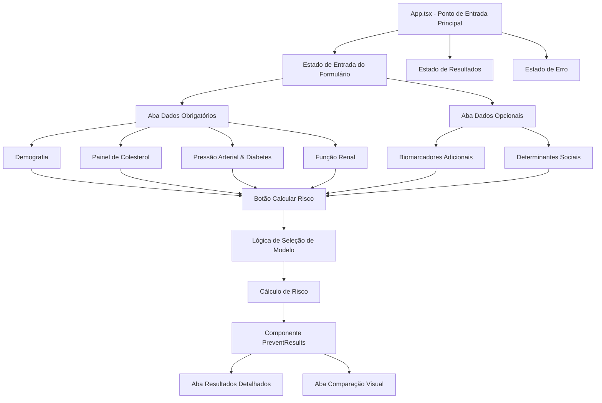
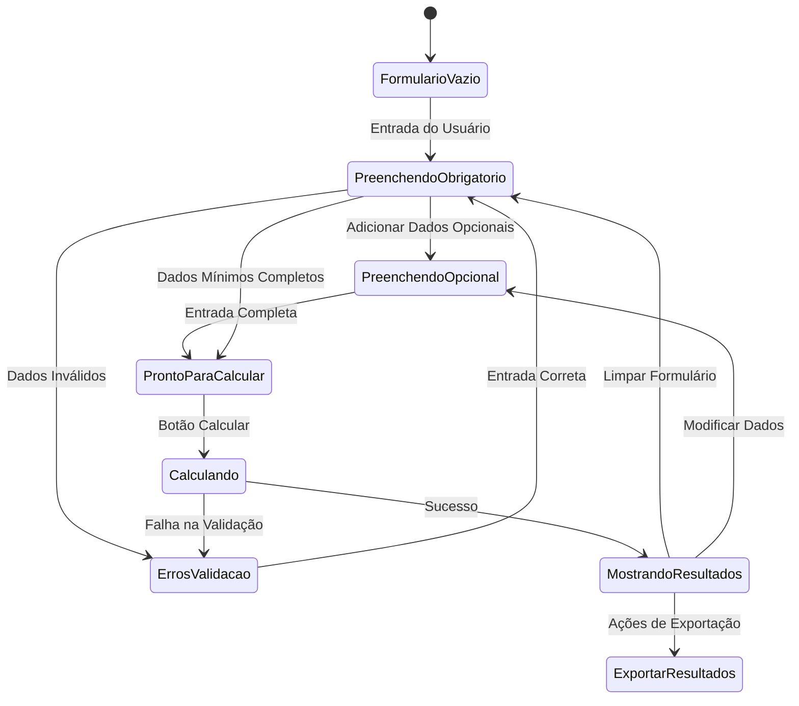
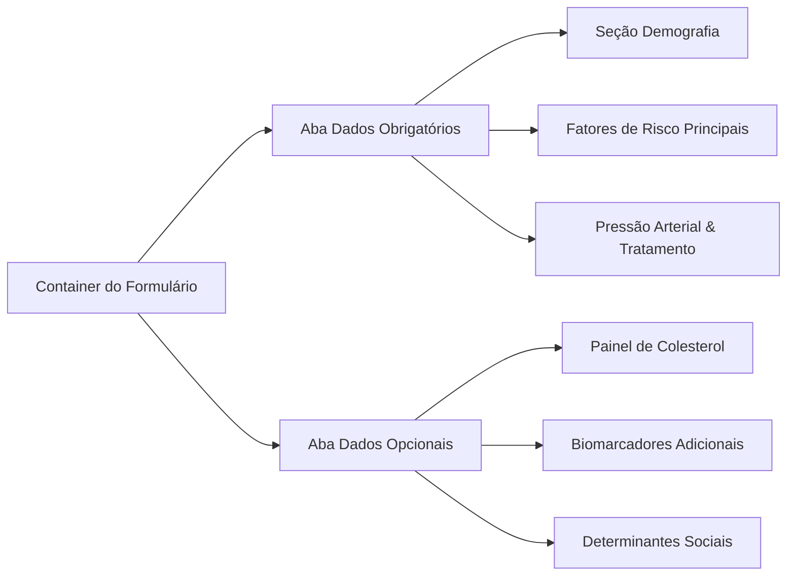
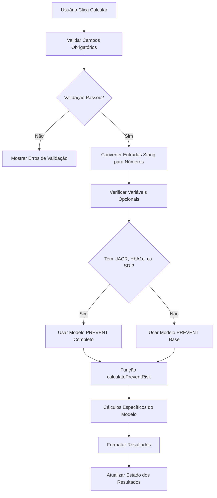
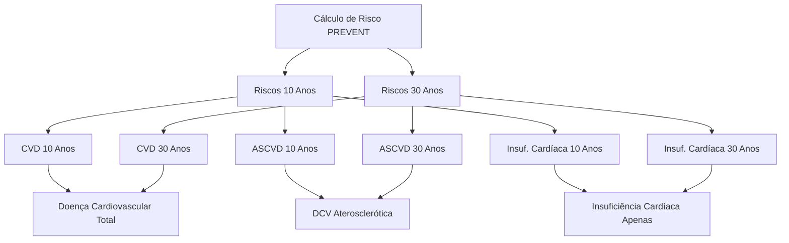
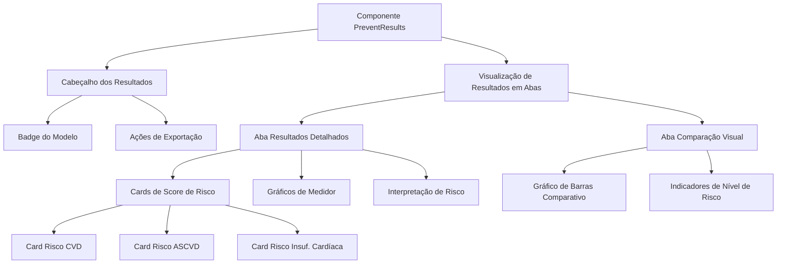
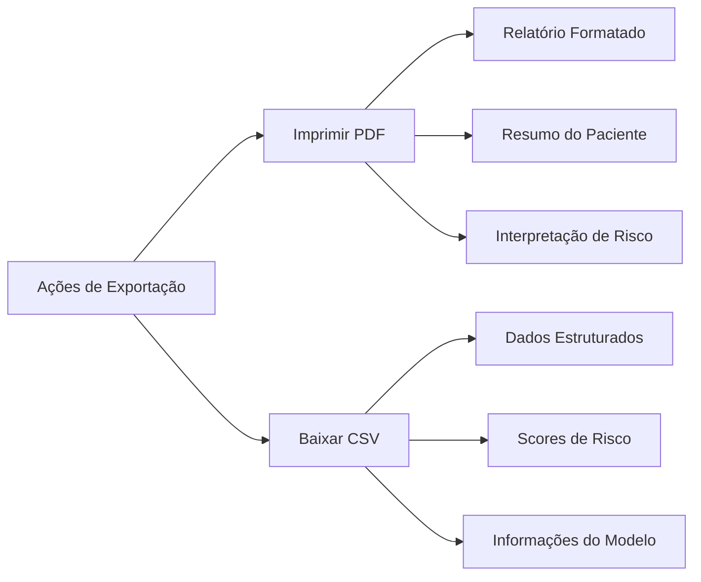
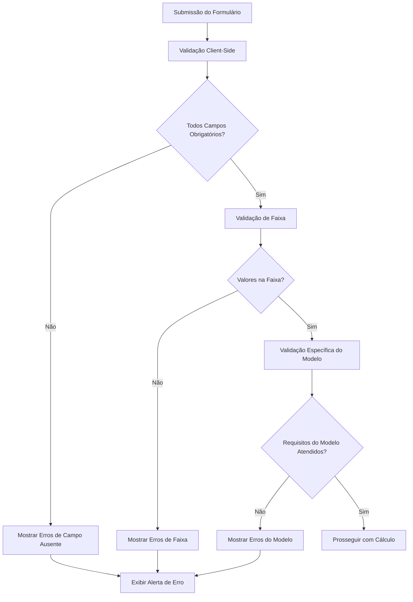

# Arquitetura da Calculadora PREVENT - Rotas e Cálculos de Score

## Visão Geral

Este documento descreve a implementação das rotas e arquitetura de cálculo de scores da Calculadora PREVENT, uma ferramenta web para avaliação de risco cardiovascular baseada nas equações oficiais do American Heart Association (AHA). A aplicação utiliza uma arquitetura de página única (SPA) sem roteamento tradicional de URL, focando em navegação baseada em estado e implementações modulares de scoring.

## Stack Tecnológico e Arquitetura

- **Framework**: React 19 + TypeScript
- **Build Tool**: Vite 6.3.5  
- **Estilização**: Tailwind CSS 4.1.7 com componentes ShadCN UI
- **Gerenciamento de Estado**: Estado local do React com hooks
- **Manipulação de Formulários**: React Hook Form + validação Zod
- **Gráficos**: Recharts para visualização de dados

## Arquitetura do Fluxo da Aplicação

### Estrutura de Aplicação de Página Única

A aplicação implementa um fluxo orientado por estado ao invés de roteamento tradicional:



### Fluxo de Gerenciamento de Estado



## Arquitetura dos Dados de Entrada

### Definições de Interface

```typescript
interface PreventInputs {
  // Demografia Obrigatória
  sex: string;          // '0' = masculino, '1' = feminino
  age: string;          // 30-79 anos
  
  // Fatores de Risco Cardiovascular
  sbp: string;          // PA Sistólica 90-200 mmHg
  dm: string;           // Diabetes '0' ou '1'
  smoking: string;      // Status de tabagismo '0' ou '1'
  egfr: string;         // eGFR >0 mL/min/1.73m²
  bptreat: string;      // Tratamento PA '0' ou '1'
  
  // Painel de Colesterol Opcional
  tc: string;           // Colesterol total 130-320 mg/dL
  hdl: string;          // Colesterol HDL 20-100 mg/dL
  statin: string;       // Uso de estatina '0' ou '1'
  
  // Variáveis Adicionais Opcionais
  bmi: string;          // IMC 18.5-39.9 kg/m²
  uacr: string;         // UACR ≥0 mg/g
  hba1c: string;        // HbA1c >0 %
  sdi: string;          // Decil SDI 1-10
}
```

### Arquitetura de Validação de Formulários

| Categoria de Campo | Regras de Validação | Tratamento de Erro |
|------------------|------------------|----------------|
| Demografia | Idade: 30-79, Sexo: Obrigatório | Feedback imediato |
| Colesterol | CT: 130-320, HDL: 20-100 | Validação opcional |
| Pressão Arterial | PAS: 90-200 mmHg | Validação obrigatória |
| Função Renal | eGFR: >0 | Validação obrigatória |
| Biomarcadores Opcionais | UACR: ≥0, HbA1c: >0 | Validação opcional |
| Determinantes Sociais | SDI: 1-10 decis | Validação opcional |

### Organização de Entrada em Abas



## Implementação do Cálculo de Score

### Lógica de Seleção de Modelo

A aplicação seleciona automaticamente o modelo PREVENT apropriado baseado nos dados disponíveis:



### Visão Geral dos Modelos de Cálculo

| Tipo de Modelo | Variáveis Obrigatórias | Variáveis Opcionais | Categorias de Scoring |
|------------|-------------------|-------------------|-------------------|
| **Modelo Base** | Sexo, Idade, PAS, DM, Tabagismo, eGFR, Tratamento PA | CT, HDL, Estatina, IMC | CVD, ASCVD, IC |
| **Modelo Completo** | Base + Qualquer Opcional | UACR, HbA1c, SDI | CVD, ASCVD, IC |

### Categorias de Score de Risco

A calculadora produz seis scores de risco primários:



### Implementação Matemática

#### Processo de Conversão de Score de Risco

1. **Pré-processamento de Entrada**:
   - Converter entradas string para valores numéricos
   - Tratar variáveis opcionais ausentes
   - Aplicar conversões de unidade (colesterol mg/dL para mmol/L)

2. **Cálculo de Regressão Logística**:
   ```
   log_odds = β₀ + β₁×termo_idade + β₂×termo_colesterol + ... + βₙ×termos_interação
   ```

3. **Conversão de Probabilidade**:
   ```
   porcentagem_risco = 100 × exp(log_odds) / (1 + exp(log_odds))
   ```

4. **Regras Específicas por Idade**:
   - Riscos de 30 anos calculados apenas para idades ≤59
   - Faixas de validação específicas para cada variável

#### Funções Auxiliares

| Função | Propósito | Implementação |
|----------|---------|----------------|
| `sdicat(sdi)` | Converter decil SDI para tercil | 1-3→0, 4-6→1, 7-10→2 |
| `mmol_conversion(chol)` | Converter unidades de colesterol | mg/dL × 0.02586 = mmol/L |
| `adjust(uacr)` | Tratar valores baixos de UACR | se <0.1 então 0.1 |

## Arquitetura de Exibição de Resultados

### Hierarquia de Componentes



### Sistema de Visualização de Risco

#### Classificação de Nível de Risco

| Nível de Risco | Faixa Percentual | Código de Cor | Ícone |
|------------|------------------|------------|------|
| Baixo | <5% | Verde (#10b981) | CheckCircle |
| Moderado | 5-9.9% | Amarelo (#f59e0b) | Info |
| Alto | 10-19.9% | Laranja (#f97316) | AlertTriangle |
| Muito Alto | ≥20% | Vermelho (#ef4444) | AlertTriangle |

#### Tipos de Gráficos

1. **Gráficos de Medidor**: Indicadores de progresso circular para scores de risco individuais
2. **Gráficos de Barras**: Visualização comparativa entre tipos de risco e períodos de tempo
3. **Barras de Progresso**: Indicadores lineares de nível de risco

### Funcionalidade de Exportação



## Arquitetura de Tratamento de Erros

### Fluxo de Validação



### Tipos de Erro e Mensagens

| Categoria de Erro | Regra de Validação | Mensagem em Português |
|---------------|-----------------|-------------------|
| Campos Obrigatórios | Dados obrigatórios ausentes | "Campo obrigatório" |
| Faixa de Idade | 30-79 anos | "Idade deve estar entre 30-79 anos" |
| Faixa de Colesterol | CT: 130-320, HDL: 20-100 | "Colesterol fora da faixa válida" |
| Pressão Arterial | PAS: 90-200 mmHg | "Pressão arterial fora da faixa" |
| Função Renal | eGFR > 0 | "eGFR deve ser maior que 0" |

## Estrutura de Arquivos da Implementação

### Componentes Principais

| Arquivo | Responsabilidade | Localização |
|---------|-----------------|-------------|
| `App.tsx` | Componente principal, gerenciamento de estado | `/src/App.tsx` |
| `PreventResults.tsx` | Exibição de resultados e visualizações | `/src/components/PreventResults.tsx` |
| `prevent-equations.ts` | Implementação das equações PREVENT | `/src/lib/prevent-equations.ts` |
| `utils.ts` | Funções utilitárias | `/src/lib/utils.ts` |
| `use-mobile.ts` | Hook para detecção mobile | `/src/hooks/use-mobile.ts` |

### Componentes de UI

A aplicação utiliza uma biblioteca completa de componentes ShadCN UI localizados em `/src/components/ui/`:

- **Formulários**: `input.tsx`, `select.tsx`, `label.tsx`, `form.tsx`
- **Layout**: `card.tsx`, `tabs.tsx`, `separator.tsx`
- **Feedback**: `alert.tsx`, `badge.tsx`, `progress.tsx`
- **Interação**: `button.tsx`, `dialog.tsx`, `tooltip.tsx`

### Modelos de Equações PREVENT

#### Modelo Base
- **Variáveis obrigatórias**: Sexo, idade, pressão arterial sistólica, diabetes, tabagismo, eGFR, tratamento de hipertensão
- **Variáveis opcionais**: Colesterol total, HDL, uso de estatina, IMC
- **Outputs**: Riscos CVD, ASCVD e IC para 10 e 30 anos

#### Modelo Completo
- **Inclui todas as variáveis do modelo base**
- **Variáveis adicionais**: UACR, HbA1c, SDI
- **Maior precisão**: Utiliza biomarcadores e determinantes sociais

### Fluxo de Cálculo de Risco

1. **Validação de entrada**: Verificação de campos obrigatórios e faixas válidas
2. **Seleção de modelo**: Automática baseada na disponibilidade de dados
3. **Conversão de dados**: String para número, unidades de medida
4. **Cálculo matemático**: Aplicação das equações de regressão logística
5. **Formatação de saída**: Arredondamento e estruturação dos resultados

### Características de Performance

- **Build otimizado**: Vite com tree-shaking para bundle mínimo
- **Lazy loading**: Componentes carregados sob demanda
- **Memoização**: Cálculos complexos otimizados com React.memo
- **Responsividade**: Interface adaptável para desktop e mobile

### Recursos de Acessibilidade

- **Navegação por teclado**: Suporte completo
- **Leitores de tela**: Labels e ARIA appropriados
- **Contraste**: Cores que atendem WCAG 2.1
- **Foco visual**: Indicadores claros de elemento ativo

## Considerações de Deployment

### Configuração para Produção

- **Build estático**: Geração de arquivos estáticos para hospedagem
- **Otimização**: Minificação de CSS/JS, compressão de imagens
- **Cache**: Headers apropriados para assets estáticos
- **PWA**: Capacidade de instalação como aplicativo web

### Compatibilidade

- **Navegadores**: Chrome, Firefox, Safari, Edge (versões modernas)
- **Dispositivos**: Desktop, tablet, smartphone
- **Acessibilidade**: WCAG 2.1 AA compliance

Esta arquitetura garante uma experiência de usuário fluída, cálculos precisos e interface intuitiva para profissionais de saúde utilizarem a Calculadora PREVENT em suas práticas clínicas.